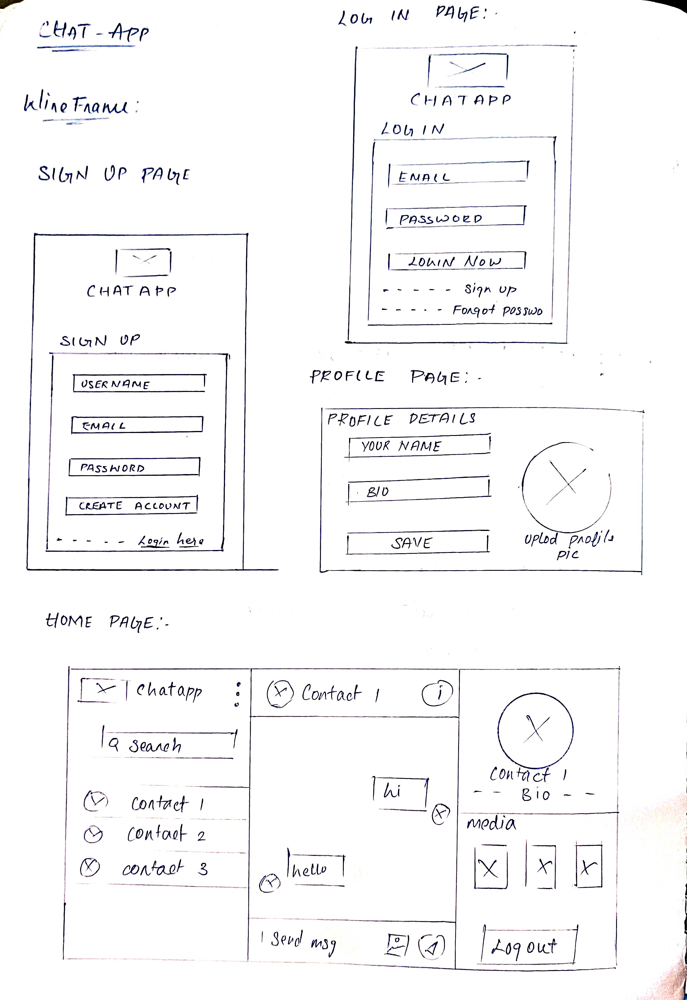

# Real-Time Chat Application  
## Objective  
A real-time chat application to communicate with text and share media between users.  

## Project Workflow  
### 1. Login Page  
- Users enter their email/username and password to access their account.  
- If the details are correct, they go to the chat screen.  

### 2. Signup Page  
- New users create an account by providing basic details like name, email, and password.  
- Once signed up, they can log in and start chatting.  

### 3. Forgot Password Page  
- If users forget their password, they can reset it by entering their email.  
- A reset link or code is sent to their email to create a new password.  

### 4. Chat Box Page  
- This is the main page where users send and receive messages in real time.  
- They can chat with their contacts.  
- Messages appear instantly.  

### 5. Profile Editing Page  
- Users can update their name, profile picture, and bio.    

### 6. Logout  
- Users can log out to exit the app securely.  
- Once logged out, they need to log in again to use the chat.  

chat application

## wireframe :

